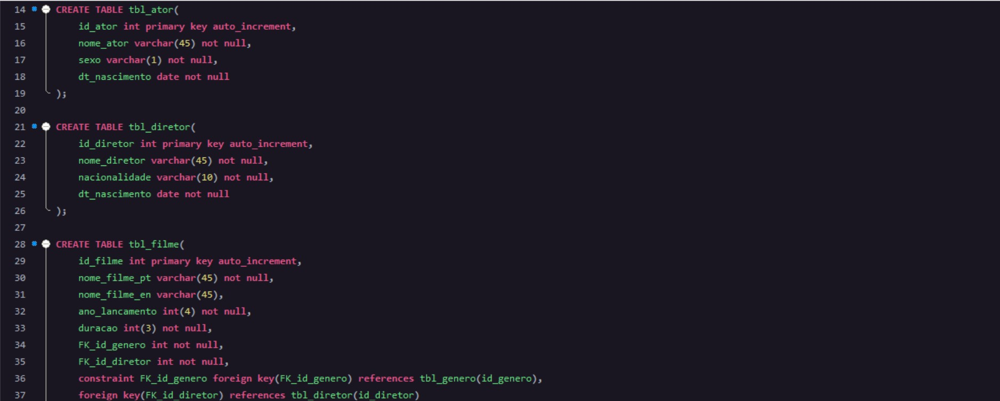

<!-- Começo/ Apresentação -->
<h1 align="center">🌗 Dark Theme MySql Workbench 🌗</h1>
<h3 align="center"> ⚡ Dark theme: ⚡</h3>

<!-- Imagens do Projeto -->
<div align="center">
 <br>
<!-- Atribuições-->
Base XML from <a href="https://stackoverflow.com/users/1555581/elmestre"><em>elMestre</em><a/> in <a href="https://www.ti-enxame.com/pt/themes/mysql-workbench-dark-theme/1073024396/"><em>ti-enxame.com</em</a>
</div>

<hr></hr>    
    
<h2 align="left">🤔  How can I use it?:</h2>

```
Download editor_code.xml
```

<p>Paste it in C:\Program Files\MySQL\MySQL Workbench 6.3 CE\data or in your data folder in MySql Workbench</p>
